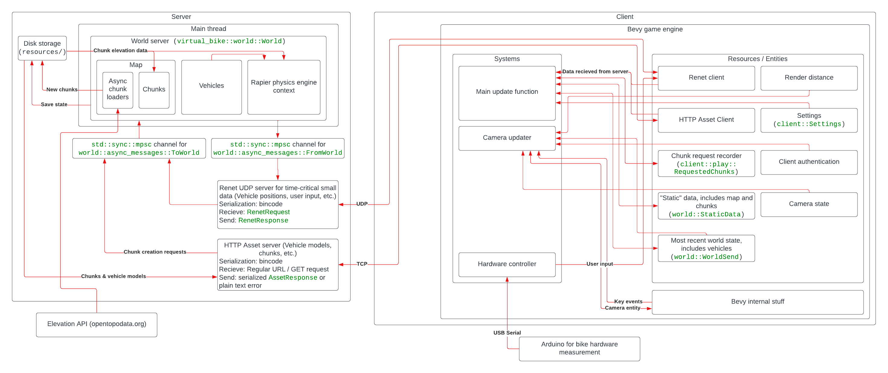

# Virtual Bike

## Warning - This is currently a work-in-progress and it still has many bugs and TODOs

## About

This is a multiplayer client-server game written in Rust. It is meant to be controlled by a stationary bike, sort of like Zwift.

## Gameplay

Each user has a "Vehicle" which is probably a bike, but can be a car or something, which is why I chose such a generic term. Each vehicle can either be controlled by Rapier meaning it is driving across the terrain, or it can be "path bound" where it's movement is restricted to a "path" which represents a road (Paths are Bezier Splines).

Currently, the game supports power, steering, and brake input from the stationary bike hardware. The Arduino program for reading measurements from the bike is in the `arduino_bike_measurement` folder. `resources/calibration.json` is used by the client for calibrating these measurements.

## How it works

</img>
\* The free version of Lucidchart only allows so many shapes, so the above graphic is missing some details.

### Server

The server runs the <a href="https://crates.io/crates/rapier3d">Rapier physics engine</a> for vehicles ("players") which are unattached to any path.
There is also a custom simulation I wrote for vehicles attached to paths to simulate gravity, drag, etc.

It is also responsible for generating chunks which are square sections of a map's terrain, sort of like in minecraft. Chunks can be either pseudo-random generated or downloaded from a real-world terrain API (Currently <a href="https://www.opentopodata.org/datasets/aster/">https://www.opentopodata.org/datasets/aster/</a>).

Communication with the client(s) is mainly done through <a href="https://crates.io/crates/renet">Renet</a> which handles data such as user input and broadcasting the current state of the game to all clients. For game assets which can be large files and are usually static (Stored on the disk and are never modified), an HTTP server is used (Asset Server, not to be confused w/ Bevy's AssetServer). The port which is used by the Renet server is set by `resources/port.txt` and the port of the asset server is that + 1.

### Client

The client uses <a href="https://bevyengine.org/">the Bevy game engine</a> for graphics as well as running most of the client-side logic as bevy systems. The hardware controller, which reads input data over USB and sends it to the server, uses bevy and bevy egui.

The code for signing in to a server is just a plain CLI because for reasons I don't know, the `winit` crate which is used by bevy and egui can't create multiple windows from the same process.